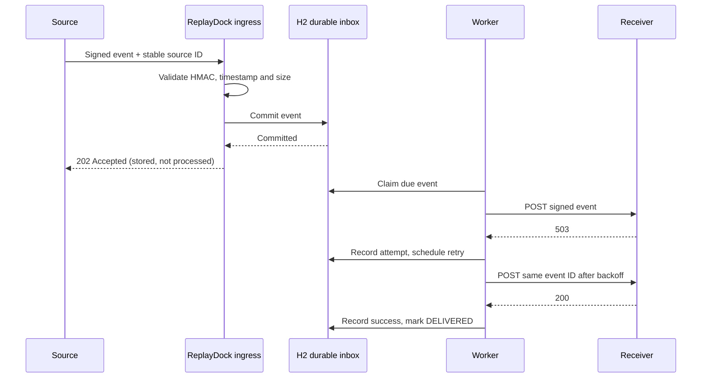

# ReplayDock

**A webhook failure lab that makes delivery failures visible, reproducible, and recoverable.**

ReplayDock accepts signed events into a durable inbox, acknowledges the sender, and delivers asynchronously. Break the mock receiver, watch retries recover, and replay the same event without repeating its business action.

  

## The demo

1. Start the app and sign in as `admin`.
2. Create an endpoint with the destination left empty.
3. Keep the receiver controls at **2 failures**, **503**, **0 ms delay**.
4. Click **Run recovery demo**. The source gets `202 Accepted` immediately after the event is committed.
5. Watch the timeline: `503 → 503 → 200`, with increasing backoff.
6. Click **Replay event**. Delivery succeeds again, but the receiver's unique business-action count stays at **1**.

Try `400` to see a permanent failure, more failures than the attempt budget to create a dead letter, or a delay over 3000 ms to simulate an ambiguous timeout.

## Run locally

Requires JDK 17 or newer. Maven Wrapper downloads Maven on first use; dependency downloads need internet access.

Windows PowerShell:

```powershell
$env:REPLAYDOCK_ADMIN_PASSWORD = 'choose-a-local-password'
.\mvnw.cmd spring-boot:run
```

macOS / Linux:

```sh
export REPLAYDOCK_ADMIN_PASSWORD='choose-a-local-password'
./mvnw spring-boot:run
```

Open **http://127.0.0.1:8080** and sign in as `admin`. If no password is configured, startup generates and logs a temporary local password. An H2 file database is stored in `data/`; it survives restarts and is ignored by Git.

```sh
./mvnw verify
./mvnw package
java -jar target/replaydock-0.1.0.jar
```

## What it does

- Durable acceptance: no success acknowledgment before the database commit.
- Per-endpoint HMAC secret, timestamp validation, and bounded UTF-8 request bodies.
- Stable source IDs: identical duplicates acknowledge the existing event; changed bodies return `409`.
- Asynchronous HTTP delivery with 3-second timeout and no redirects.
- Exponential backoff for connection failures, timeouts, `408`, `429`, and `5xx`.
- Dead letters after the attempt budget, or immediately for other non-success responses.
- Manual replay preserves the body and source ID; previous attempt history stays visible.
- Mock controls for failures, status codes, and response delay; durable receiver deduplication.
- Authenticated dashboard with delivery timeline and payload inspection.
- Recovery of interrupted deliveries after restart.

## Architecture



Events move through `PENDING → DELIVERING → DELIVERED`, or back to `PENDING` on retry, or to `DEAD`. The worker sends one event at a time; database claims are committed before the network call. This intentionally favors an understandable single-instance lab over a distributed queue.

### Delivery guarantee

**At least once**, with a finite automatic retry budget. A receiver may process an event even when its response times out, or the worker may crash after delivery but before recording success. Restart recovery and manual replay can therefore deliver duplicates. The receiver must deduplicate business actions using `(endpoint, source event ID)`; the mock demonstrates that with a database primary key. This is not an exactly-once network guarantee.

## Signed ingress

See [the API guide](docs/API.md) and [the architecture and security notes](docs/ARCHITECTURE.md). An endpoint's secret is returned on creation; normal list/read APIs omit it.

ReplayDock uses its own header/signature convention. It is **not a drop-in GitHub, Stripe, or other provider webhook verifier**. Provider adapters would validate their native signatures before passing events into the inbox.

Use the included sender with Python 3 (standard library only):

```powershell
$env:REPLAYDOCK_SIGNING_SECRET = 'secret-returned-on-endpoint-creation'
python scripts/send_event.py --endpoint ENDPOINT_UUID --event-id payment-001 --body '{"type":"payment.succeeded"}'
```

Sending the same ID and same exact body again acknowledges the original event without enqueuing another delivery. The sender refreshes the signature timestamp on every request.

## Configuration

| Environment variable | Default | Purpose |
|---|---|---|
| `REPLAYDOCK_ADMIN_PASSWORD` | Generated at startup | Local admin sign-in |
| `PORT` | `8080` | Application and built-in receiver port |
| `REPLAYDOCK_BIND_ADDRESS` | `127.0.0.1` | Bind interface |
| `REPLAYDOCK_DATABASE_URL` | H2 file in `data/` | JDBC URL |
| `REPLAYDOCK_DATABASE_PASSWORD` | Empty | H2 database password |
| `REPLAYDOCK_ALLOWED_ORIGINS` | Empty | Comma-separated exact HTTPS destination origins |
| `REPLAYDOCK_WORKER_ENABLED` | `true` | Turn off automatic dispatch for controlled tests |

For an external receiver, explicitly allow its origin before starting:

```sh
export REPLAYDOCK_ALLOWED_ORIGINS='https://receiver.example'
```

Destination URLs must use HTTPS, have no embedded credentials or fragment, and match an allowed origin including its non-default port. Redirects are not followed. Only approve destinations you control; this origin allowlist is not DNS-rebinding protection.

## JPA persistence

The application uses Spring Data JPA and Hibernate. `WebhookEndpoint`, `WebhookEvent`, `DeliveryAttempt`, `MockControl`, and `ProcessedEvent` map to the existing tables. Relationships use lazy associations; controllers return immutable API records instead of exposing entities or secrets.

`@Transactional` services commit acceptance before returning to the controller and record an attempt together with its next event state. Endpoint and mock-control row locks serialize duplicate handling. A conditional JPQL update claims a pending event atomically. The HTTP request remains outside database transactions.

`schema.sql` still initializes the stable schema, and `ddl-auto=validate` verifies mappings without rewriting existing tables or deleting data. Open Session in View is disabled.

## Project layout

```text
src/main/java/io/replaydock/
  ApiController.java       Admin API, signed ingress and mock receiver
  DockService.java         Transactional orchestration and API record mapping
  persistence/             JPA entities and Spring Data repositories
  DeliveryWorker.java      HTTP dispatcher and restart recovery
  Signatures.java          HMAC generation and validation
  TargetPolicy.java        Destination origin allowlist
  SecurityConfig.java      Admin authentication and CSRF protection
src/main/resources/
  schema.sql               Stable schema; Hibernate validates entity mappings
  static/                  Dashboard (vanilla JS/CSS)
src/test/                  Delivery and authentication regression tests
docs/                      API and architecture details
scripts/send_event.py      Signed event sender
```

## Scope and next steps

This is a **local portfolio lab**, not a hosted production relay. It uses one worker, one admin, a file database, and no retention jobs. Endpoint secrets and event bodies are stored in the local database; treat the database as sensitive. Do not send real credentials or personal/payment data in demo payloads.

Potential extensions: PostgreSQL with leased concurrent claims, provider-specific signature adapters, encrypted secrets with rotation, payload retention policies, a transactional outbox, and `Retry-After` support. These are not implemented in v0.1.

## License

MIT. See [LICENSE](LICENSE).
